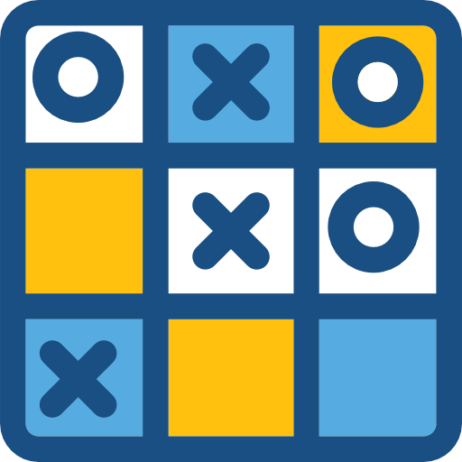

# 🎮 Tic Tac Toe Classic
A responsive web implementation of the classic Tic Tac Toe game with retro-modern styling and smooth gameplay.
<div align="center">
  
</div>

## 🌟 Features
- **Responsive Design** - Works flawlessly on mobile, tablet, and desktop
- **Clean UI** - Retro-modern aesthetic with smooth animations
- **Win Detection** - Instant winner recognition for rows, columns, and diagonals
- **Auto-Draw Detection** - Smart tie game recognition
- **One-Click Restart** - Instant game reset functionality
- **Performance Optimized** - Lightweight (under 300KB total)
- **Cross-Browser** - Works on all modern browsers

## 🚀 Quick Start
1. Clone the repository:
   ```bash
   git clone https://github.com/your-username/tic-tac-toe.git
   ```
2. **Open in browser**:
   ```bash
   open index.html
   ```
3. **Play** X goes first, alternate turns, first to 3 wins!

## 🛠️ Technologies
    

## 📁 Project Structure
```text
TicTacToe/
├── index.html          # Main game interface
├── CSS/
│   └── style.css       # Styling and responsive design
├── JavaScript/
│   └── main.js         # Core game logic
└── images/
    └── TicTacToe.png   # Game favicon
```

## 🎨 Design Specs
### Color Palette

| Color         | Hex        | Usage               |
|---------------|------------|---------------------|
| **Player X**  | `#56ace0`  | X marker background |
| **Player O**  | `#fbc30c`  | O marker background |
| **Background**| `#a7cbd5`  | Page background     |
| **Accent**    | `#0080c0`  | Headers and text    |
| **Panel**     | `#f1f1f1`  | Game container      |

### Typography
- **Primary Font**: Silkscreen (Retro pixel font)
- **Base Size**: 16px (1rem)
- **Heading Hierarchy**: 2.5rem → 2rem → 1.5rem

## 📱 Responsive Breakpoints
| Device         | Breakpoint | Features                        |
|---------------|-------------|---------------------------------|
| **Mobile**    | ≤600px      | X marker background             |
| **Tablet**    | 601-1024px  | O marker background             |
| **Desktop**   | ≥1025px     | Full neumorphic shadow effects  |

## 🧠 Core Game Logic
```javascript
// Game state management
let gMove = 0;            // Track total moves
let gGameOver = false;    // Game status flag
let gGrid = 3x3 Array;    // Game board state

// Main functions
function onLoad() {}      // Initialize game
function choose() {}      // Handle player move
function checkWinner() {} // Validate win/draw
```

## 📄 Game Rules
1. **Players alternate placing X's and O's**  
2. **First to 3 consecutive marks wins**  
3. **Win conditions**:  
   - Horizontal row  
   - Vertical column  
   - Diagonal line  
4. **9 moves with no winner = Draw**

## 📜 License
Distributed under the MIT License. See LICENSE for more information.

Made with ❤️ by Vertos<div align="center">
  
<div align="center">
  **[🚀 Play Now](https://vertosofficial.github.io/TicTacToe/)** | **[🐞 Report Issue](https://github.com/vertosofficial/TicTacToe/issues)**
</div>
